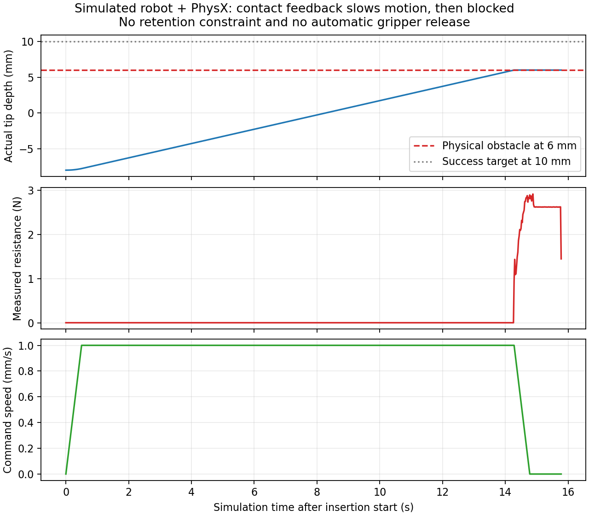

# USB 插入实际验证记录（2026-09-16）

坐标更正说明（2026-09-17）：下述记录使用旧基座 XY `[-0.07,0.37]`（左臂坐标系）。当前配置已按用户更正为 `[0.37,-0.07]`；随后按用户要求，基座原点高度改为线槽坐标系 Z=10 mm，并豁免插座与线槽、底板的固定安装碰撞。收尾顺序也已按用户要求改为右臂先释放回位、左臂随后插入并在固定后释放回位。这些历史成功记录不代表新安装位置和新动作顺序的完整运动已经验证。

本轮**真实 USB-only 全流程通过**：原双臂 MTC 全部运动 → 实测 USB 对齐 → 低速插入 → 判据保持 → 显式插座保持 → 双爪释放 → 安全退出 → 双臂 SRDF `ready`。**带 rope_actor 的整条任务未通过**：原 MTC 搬运阶段失去有效抓持，未进入插入阶段。以下分别记录，不能相互替代。

原始日志、JSONL、摘要及 SHA256 清单位于工作区 `artifacts/usb_insertion_20260916/`。JSONL 为真实每控制周期观测；部分文件使用 gzip 无损压缩。相对位姿来自仿真真值，不代表仅凭力可完成状态判定，也不代表实物重复精度或电气连接。

## 几何和载荷部件验证

[几何数据](usb_insertion_geometry.json) 来自两个用户 STL 和 USB1.stl 的截面/包围盒计算；[PhysX 导入探针](usb_insertion_physics_probe.json) 使用真实动态刚体、安装约束和原生接触，但没有机器人，**不是完整插入验收**。

- 实際导入为 37 个 ConvexMeshGeometry；10 mm 深度的金属段处于有效空腔，孔未被整体凸包封闭。
- 沿 -X 对孔底施加 1 N，测得基座对 USB 的轴向反力约 +0.999995 N；无接触为有效零值。
- 孔壁接触并同时施加 `[-0.2,+1,0] N`，安装反力约 `[+0.199970,-0.999891,+0.000062] N`，证明存在可靠轴向摩擦反馈。原法向通道不能替代该完整反力。
- 力矩以孔中心为参考，独立验证与力臂叉乘一致（测试允许 0.001 N·m 的动态积分误差）。
- 添加其他刚体对基座加载时，反馈正确标为不可辨识，不能作为 USB 插入力。
- 基座禁用重力，避免把自重算进插入力；USB 和线缆的重力没有关闭。

## USB-only 全流程

实际使用 ROS Humble、MoveIt Task Constructor、ManiSkill2/SAPIEN 2、真实双臂 URDF 和研究手指 CAD。无 GUI；GPU/Vulkan 在允许访问设备的环境下运行。沙箱内完整机器人初始化的 Vulkan 错误单独留档，不算物理失败或成功。

最终成功运行：`usb_only_mtc5.log`、`usb_only_mtc5_forces.jsonl[.gz]`、`usb_only_summary.json`、`ros_final_audit.json`。

| 检查 | 实际结果 |
| --- | --- |
| 保留全部原 MTC | 完成最后原阶段后才启动孔前操作 |
| 预插入与精密对齐 | 实测 `inverse(T_TCP)*T_USB` 参与目标计算；MoveIt 完成运动及插入直线碰撞预检 |
| 固定前实际前端深度 | **9.9063 mm**，目标 10 mm、容差 0.15 mm |
| 固定前横向误差 | **0.04714 mm**，限值 0.25 mm |
| 固定前姿态误差 | 在当前浮点测量精度内接近零；不解释为绝对零误差 |
| 固定前实际相对速度 | **0.0364 mm/s**、**0.000168 rad/s** |
| 判据保持 | 至少 0.3 s 仿真时间，无 USB—基座保持约束 |
| 插入过程临时/隐藏夹持 | USB—世界、USB—TCP、USB—插座计数均为 0；仅真实手指接触 |
| 保持创建 | 先记录成功，再按实际相对位姿创建 USB—基座约束 |
| 创建前后位姿/速度 | 记录逐项完全相同，无位姿重写、无速度清零 |
| 开爪后 USB | 留在插座；监测转为 `gripper_released`，固定前抓取记录保留 |
| 双臂退出、回位 | 沿各 TCP -Z 退出 50 mm，再由 MoveIt 回 `ready` |
| 最终关节精度 | 左右臂各关节距 `ready` 最大约 0.000098 rad |
| 四项结果 | insertion_success / retention_active / grippers_released / return_complete 均 true |
| USB-only 后端排除 | cable.enabled=false、created=false、solver=disabled；独立后端禁用回归通过 |
| 规划场景转换 | 世界 USB 唯一，机器人 attached objects 中没有 USB |
| 重复 start | 返回 complete，不再运动或创建保持 |
| reset | 实体/约束/线缆清理；MoveIt USB 世界、附着及插座物体全部移除 |

本轮末端全流程在仿真时间约 117.94 s 达到 complete。当前程序在成功后保留场景供观察；MTC 节点退出不等于模拟器自动退出。

独立的 `local_default` 检查在孔前设置机器人的**测试初态**，随后真实闭爪、解除定位、对齐、推进、保持和开爪。开爪后 USB 位移约 `7.8e-8 m`。该记录补充局部物理证据，不用来替代从原 MTC 完成后的完整流程记录。脚本只在 USB 创建前设置机器人初态关节位置；插入阶段不直接设置 USB 位姿。

## 真实障碍与连续反馈

`local_obstacle.jsonl[.gz]` 给同一原生插座增加真实刚体障碍，将可用孔深缩短到 6 mm，而成功目标仍为 10 mm。不是修改测量值、mock 接触或用隐藏固定约束制造阻力。

- 实测阻力增加到约 2.92 N 时，速度连续从 1 mm/s 经 0.72、0.44、0.16 mm/s 减至 0；滤波阻力约 2.63 N 时保持零推进。
- 实际前端停在约 5.995 mm，随后以 `blocked / no_measured_tip_progress` 停止。
- `insertion_success=false`、`retention_active=false`；没有固定或自动张爪。
- 没有强行穿透障碍或把指令走完当成功。



## 调试中发现并处理的问题

早期 `usb_only_mtc2` 在孔前规划中发现 USB 与右臂接触，未执行无效解。尝试较高孔上方目标的 `mtc3` 未找到有效目标解。按用户建议，最终支持最多 10 次独立 MoveIt 求解，保持真实碰撞检查；最终成功工况各末端阶段在该轮第 1 次求解成功。专门的编排测试验证前两次规划失败后第 3 次成功才执行，执行失败不会盲目重放。

`mtc4` 已真实插入并固定，但右爪第一指到 40 mm、第二指受原末态附近槽壁限制在约 18.34 mm，系统正确报告释放失败，未继续回位。依据分体孔 CAD，改为右爪总开口 30 mm（每指实测至少 14 mm），形成超过 25.9 mm 的净通道，再直线退出；左爪仍总开口 80 mm。`mtc5` 完整通过。没有放开物理碰撞或把单指到位视为双指释放。

原 USB-only 的 500 Hz / 20 位置迭代在新碰撞体下存在约 0.25 rad/s 的微振动，不能满足低速固定门限。本次在插入启用时采用独立 1 kHz 刚体子步和至少 200/10 位置/速度迭代，固定门限没有放宽，也没有手动清零速度。

## rope_actor 集成边界

`rope_mtc.log`、`rope_mtc_forces.jsonl[.gz]`、`rope_summary.json` 记录真实带线缆实验：提前定位、双臂接近、真实接触闭合、解除临时支撑、验证及下降通过；随后在原 stage 09 左臂搬运中发生明显相对转动。

- 抓取状态先 `slipping`，后 `dropped`；后者仿真时间约 22 s，相对平移约 5.477 mm、转角 **1.1384 rad**。两指仍可有约 3.81/3.84 N 法向力，说明“有夹持力”本身不能证明保持了正确抓姿。
- 线缆后端真实创建并运行，USB—线缆连接保留；没有插入前的 USB 世界/TCP/插座保持。
- 插入状态仍是 `not_started`，四个结果标志均为 false。为结束已失败的实验，主动以 SIGINT 停止 launch；末尾 KeyboardInterrupt 是测试清理。
- **没有完成带线缆插入、保持后的动态脱孔和双臂回位验收。** 当前代码具备相应衔接和打开分体孔后的监测切换，但这不能代替实际通过。
- 未自动增加夹持力、重新抓取或添加临时支撑来绕过该问题。线缆对 USB 的载荷、动态摩擦/转动保持是后续需要处理的工况。

另一次 `rope_socket_lifecycle` 短程物理回归通过：插座和 rope_actor 同时存在时，真实接触夹持、解除临时定位、主动开爪后的滑移/掉落检测及重复资源清理均正常。该测试不包含运输和插入，不抵消上述完整任务失败。

## 自动检查与复现

三包构建通过。系统 Python 没有 pytest，ament 构建提示没有自动执行 pytest；测试使用项目虚拟环境单独运行，不能以构建成功代替测试结果。

全量回归 `full_final_tests.log`：**515 passed / 1 failed**。失败为历史 `rope_trunking_rim_20260915` 的录制深度断言：当前 CAD 复算约 3.7603 mm，录制期望 0.1599 mm。测试使用插入关闭路径；未修改历史录制数据或放宽该断言。不能声称全量回归全绿。

随后补充生命周期、退出和失败状态输出修正，相关 121 项检查通过；新增插入/重试/墙钟保护/初始化失败专项共 21 项通过；交付前连同力输出回归共 33 项通过（delivery_tests.log）。这些测试包含纯策略/编排测试，与上面的真实物理和完整 ROS 验收分列。

```bash
source /opt/ros/humble/setup.bash
source install/setup.bash
# ROS_LOG_DIR 放到可写目录，避免 launch 日志权限导致测试失败。
ROS_LOG_DIR=/tmp/usb_insertion_tests PYTEST_DISABLE_PLUGIN_AUTOLOAD=1 \
  .venv/bin/python -m pytest -q \
  src/dual_fr3_maniskill/test/test_insertion.py \
  src/dual_fr3_trunking_mtc/test/test_terminal_insertion.py
.venv/bin/python src/dual_fr3_maniskill/scripts/check_insertion_geometry.py --output /tmp/insertion_geometry.json
.venv/bin/python src/dual_fr3_maniskill/test/check_insertion_physx.py --output /tmp/insertion_physx.json
.venv/bin/python src/dual_fr3_maniskill/test/check_usb_insertion_simulation.py --output /tmp/insertion_local_new.jsonl
.venv/bin/python src/dual_fr3_maniskill/test/check_usb_insertion_simulation.py \
  --obstacle-depth .006 --output /tmp/insertion_obstacle_new.jsonl
```

完整 MTC 两种启动命令、接口和参数表见 [使用说明](usb_insertion.md)。


## 孔前闭环微调局部验证（2026-09-19）

本轮实现孔前 `align` 状态和异步短步碰撞检查；原插入阈值、孔尺寸、夹持力和摩擦不变。
相关回归（整个 MTC 测试目录及 ManiSkill 插入/夹持接口/模型/力接口等）**480 项通过**。
两个包的 symlink 构建通过。记录：`artifacts/usb_alignment_20260919/regression.log`、`regression.xml`。

新增 `test/check_usb_alignment_simulation.py` 使用实际双臂 CAD、动态 USB、真实双指闭合、
解除世界支撑及实际 PhysX 步进，并使用原生 MoveIt/FCL 检查生产代码提交的状态消息。
测试适配器在下一周期完成查询 Future；未启动 ROS 服务传输，也没有运行完整 MTC 运输。
初始关节位置仅在 USB 创建前设置；之后仅下发关节驱动目标，不写 USB 位姿。

最终记录 `artifacts/usb_alignment_20260919/local_physics_pipelined.json`：

| 指标 | 初始 | 微调完成 | 插入完成 |
| --- | --- | --- | --- |
| 前端深度 | -7.9978 mm | -7.9942 mm | 9.8926 mm |
| 横向误差 | 0.8022 mm | 0.0947 mm | 0.0970 mm |
| 朝向误差 | 1.1476° | 0.1196° | 0.1189° |
| 仿真时间 | 3.00 s | 5.54 s | 24.00 s |

完成 2,883 个短步碰撞状态检查；最终 `insertion_success=true`、`retention_active=true`。
USB—TCP 和 USB—世界支撑均未创建；插座保持只在实际插入验收后建立。
初版校验时序使插入速度减半，随后将批准上一短步和提交下一短步放在同一控制周期，
最终插入段约 18.46 s，满足原 45 s 超时；等待碰撞查询不消耗已下发位移预算。

这是 **USB-only 局部微调/插入物理验证**，不代表完整带线缆 MTC、ROS 查询时序、
插入后开爪回位已在本轮通过。带线缆时仍依赖真实抓持、线缆物理保护和捕获范围。
复现：

```bash
source /opt/ros/humble/setup.bash
source install/setup.bash
ROS_LOG_DIR=/tmp/usb_alignment_physics .venv/bin/python \
  src/dual_fr3_maniskill/test/check_usb_alignment_simulation.py \
  --output /tmp/usb_alignment_new.json
```

## 局部快速模式（2026-09-19）

推荐 YAML 改为 `insertion.local_collision_check: entry`，入口通过 MoveIt 状态检查后，
微调和轴向插入直接执行受限本地 IK。微调位置容差从 0.1 mm 改为 0.2 mm，
对齐保持从 0.3 s 改为 0.1 s，推进速度从 1 mm/s 改为 2 mm/s。
朝向容差、插入成功保持、力/抓持/关节保护和线缆物理参数保留。
`per_step` 保留原逐步异步校验，可在 YAML 中切换；状态快照显示当前模式。

相关回归 **497 项通过**（2 个依赖弃用警告），包含入口未批准不运动、入口碰撞拒绝、
入口一次检查后连续微调/插入、per_step 仍等待每步结果、过载/抓持丢失/反馈失效停止，
以及直接 start 的入口等待超过 1.5 s 时不误计为运动停滞、超过入口总时限时停止。
记录：`artifacts/usb_fast_local_20260919/regression.log`、`regression.xml`。

原生 PhysX + MoveIt/FCL USB-only 测试故意让每次查询延迟 15 个控制周期返回：

| 指标 | 初始 | 微调完成 | 插入完成 |
| --- | --- | --- | --- |
| 前端深度 | -7.9978 mm | -7.9942 mm | 9.9465 mm |
| 横向误差 | 0.8022 mm | 0.1824 mm | 0.1851 mm |
| 朝向误差 | 1.1476° | 0.2302° | 0.2305° |
| 仿真时间 | 3.00 s | 4.46 s | 14.32 s |

全过程只做 **1 个入口碰撞状态检查**（另有入口规划场景读取），
轴向插入耗时约 9.86 仿真秒，`insertion_success`、`retention_active` 均为 true。
插入前没有 USB—TCP/世界固定约束。结果：
`artifacts/usb_fast_local_20260919/local_physics.json`。

```bash
source /opt/ros/humble/setup.bash
source install/setup.bash
ROS_LOG_DIR=/tmp/usb_fast_physics .venv/bin/python \
  src/dual_fr3_maniskill/test/check_usb_alignment_simulation.py \
  --validation-delay-ticks 15 --output /tmp/usb_fast_new.json
```

延迟由测试适配器注入，未经过 ROS 服务传输；未运行完整带线缆 MTC 或插入后开爪回位。
此结果验证局部快速模式及新参数，不代表整体墙钟提速倍数或完整任务成功率。
